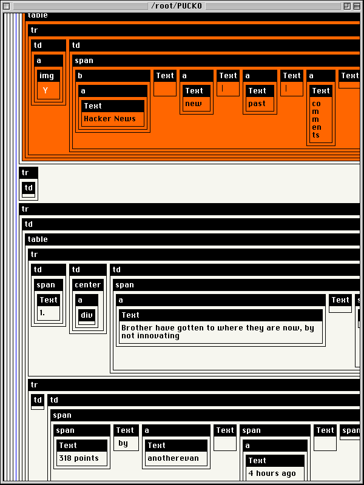

# PUCKO Linux Web Browser

Building a web browser that follows the Unix philosophy

For more information, please visit http://puckolinux.com

## Overview

The basic design goals of PUCKO Linux include:

  * Not monolithic

  * Breaking everything down into small, understandable, interchangeable programs

  * Do everything one step at a time

  * Optimization and performance is not a priority

This is mostly for educational purposes.

PUCKO Linux is an acronym that stands for **P**roblematic **U**neducated **C**omputer **K**eyboard **O**perator for Linux.

## Notes

The very first web browser was written in Objective-C.

This web browser will also be written in Objective-C.

[curl](http://curl.se)  is used to access the network.

[ImageMagick](https://imagemagick.org) (convert) is used to load image files.

## How to compile and run

Change to the directory 'PUCKO'.

```
$ perl build.pl
```

This creates an executable called 'pucko'.

Create a temp directory. Temp files will be read from and written to the current directory.

```
$ mkdir temp

$ cd temp
```

Run the executable with no arguments to see the usage text.

```
$ ../pucko
```

## Part C - HTML Tables

It would be nice to have a simple renderer for HTML emails. Generally HTML emails use tables for layout. However, the majority of websites no longer use tables for layout, which makes it somewhat difficult to find an example to use for testing. Luckily, there does exist a web site so primitive that it still uses tables..... Hacker News.

Right now, very little is being done in terms of rendering HTML elements correctly. There is minimal 'td width' and 'td bgcolor' support, just enough to show the orange bar at the top. This is what it currently looks like.

```
$ ../pucko ViewHTMLTable: https://news.ycombinator.com
```

Right-click to access the contextual menu and select 'Toggle Tag Borders'.


This is the interface for viewing the tag hierarchy.



## Part B - Parse CSS

### Step 1: Print the 'style' tag

Internal CSS is located in the text of the style tag.

The relevant code is located in 'misc/pucko-printStyleText.m'.

```
$ ../pucko printStyleText: https://google.com
```

This will download the url to the current directory and print the text of the style tag.


### Step 2: Print the 'style' attribute for all tags

Inline CSS is located in the style attribute for each tag.

The relevant code is located in 'misc/pucko-printStyleAttribute.m'.

```
$ ../pucko printStyleAttribute: https://news.ycombinator.com
```

This will download the url to the current directory and print the style attribute for each tag.


### Step 3: Print the 'link href' tags

External CSS files are specified in the 'link href' tags.

The relevant code is located in 'misc/pucko-printLinkHref.m'

```
$ ../pucko printLinkHref: https://www.freebsd.org
```

This will download the url to the current directory and print the 'link href' tags.


### Step 4: Download 'link href' tags

The relevant code is located in 'misc/pucko-downloadLinkHref.m'.

```
$ ../pucko downloadLinkHref: https://www.freebsd.org
```

This will download the files specified in the 'link href' tags to the current directory.

### Step 5: Parse the basic structure of a CSS file

The relevant code is located in 'misc/pucko-parseCSS.m'.

First download an example CSS file.

```
$ curl -o global.css https://www.freebsd.org/css/global.css
```

This will download 'global.css'.

```
$ cat global.css | ../pucko parseCSS
```

This will parse the CSS file into an array of dictionaries. Further parsing will be necessary.

### Step 6: Parse CSS @import

A CSS file is allowed to import another style sheet using '@import'.

The relevant code is located in 'misc/pucko-parseCSSImport.m'.

```
$ ../pucko testParseCSSImport: https://www.freebsd.org/css/fixed.css
```

This will parse the @import urls in the CSS file and print the urls.

### Step 7: Enumerate all external CSS rules

External CSS files are specified in the 'link href' tags.

The relevant code is located in 'misc/pucko-enumerateExternalCSS.m'.

```
$ ../pucko enumerateExternalCSS: https://www.freebsd.org
```

This will go through all the 'link href' stylesheet urls, parse the CSS, parse the stylesheets referenced by '@import', and return an array.

### Step 8: Enumerate all internal CSS rules

Internal CSS is located in the text of the style tag.

The relevant code is located in 'misc/pucko-enumerateInternalCSS.m'.

```
$ ../pucko enumerateInternalCSS: https://google.com
```

This will go through all the 'style' tags, parse the CSS, and return an array.

## Part A - Parse HTML, view text, images, and follow links

### Step 1: Parsing HTML

[HTML Tidy](http://html-tidy.org) has C code which will be used to parse HTML.

The HTML gets parsed into a hierarchy of arrays and dictionaries.

The relevant code is located in 'misc/pucko-parseHTML.m'.

The usage of HTML Tidy is self-contained in this one file.

It is a very small amount of code, since most of the work is done by HTML Tidy.

It serves as a simplified wrapper. HTML Tidy is a C API and can be cumbersome to use, because of the memory management, and the various C data types. These details are eliminated by using the simplified wrapper.

The HTML Tidy code is located in 'external/tidy-html5-5.6.0'.

Use [curl](http://curl.se) to download an HTML file.

```
$ curl -o index.html https://www.freebsd.org
```

This creates an HTML file called 'index.html'.

```
$ cat index.html | ../pucko parseHTML
```

This pipes index.html to stdin, parses it, and prints the resulting hierarchy of arrays and dictionaries.

The relevant code is located in 'misc/pucko-parseHTML.m'.


### Step 2: Print the text from the HTML

As a simple exercise, parse an HTML document and print out only the text.

The relevant code is located in 'misc/pucko-printText.m'.

```
$ cat index.html | ../pucko printText
```

This pipes index.html to stdin, parses it, and prints out only the text.


### Step 3: Print the 'src' attribute of the 'img' tag

To be able to show images, start by parsing an HTML document and printing out the img src urls.

The relevant code is located in 'misc/pucko-printImgSrc.m'.

```
$ cat index.html | ../pucko printImgSrc
```

This pipes index.html to stdin, parses it, and prints out only the 'src' attribute of the 'img' tag.


### Step 4: Resolve 'img src' relative urls to absolute urls

The relevant code is located in 'misc/pucko-resolveURL.m'.

```
$ cat index.html | ../pucko testAsRootURL
```

This pipes index.html to stdin, parses it, and tests 'asRootURL' using the 'a href' and 'img src' urls.

```
$ cat index.html | ../pucko testAsBaseURL
```

This pipes index.html to stdin, parses it, and tests 'asBaseURL' using the 'a href' and 'img src' urls.

```
$ ../pucko testResolveURL: https://www.freebsd.org
```

This downloads https://www.freebsd.org if necessary, parses it, and resolves the 'a href' and 'img src' urls, using 'https://freebsd.org' as the base url for relative urls.


### Step 5: Download the 'img src' urls

The relevant code is located in 'misc/pucko-downloadImgSrc.m'.

```
$ ../pucko downloadImgSrc: https://www.freebsd.org
```

This downloads https://www.freebsd.org if necessary, parses it, and uses curl to download the 'img src' urls to the current directory, using 'https://www.freebsd.org' as the base url for relative urls.

### Step 6: View the text and images

[ImageMagick](https://imagemagick.org) (convert) is used to read the images by converting them to the PPM format in memory (the PPM files are not saved).

The relevant code is located in 'misc/pucko-ViewImgSrc.m'.

```
$ ../pucko ViewImgSrc: https://www.freebsd.org
```

This downloads https://www.freebsd.org, parses it, and uses 'convert' from ImageMagick to read the downloaded 'img src' files that are in the current directory, and displays the images along with the text.


### Step 7: Print the 'href' attribute of the 'a' tag

To be able to follow links, start by parsing an HTML document and printing out the a href urls.

The relevant code is located in 'misc/pucko-printAHref.m'.

```
$ cat index.html | ../pucko printAHref
```

This pipes index.html to stdin, parses it, and prints out only the 'href' attribute of the 'a' tag.


### Step 8: View the a href links along with the text and images

The relevant code is located in 'misc/pucko-ViewAHref.m'.

```
$ ../pucko ViewAHref: https://www.freebsd.org
```

This downloads https://www.freebsd.org if necessary, parses it, and displays the images along with the text, if the images have been previously downloaded with 'downloadImgSrc:'.

Links are shown with a blue border. If a link is hovered, the border is made to be thicker. If there is a mouseDown event, the color changes to purple.


### Step 9: View a URL and click to follow links

This combines the previous steps into a single command.

The relevant code is located in 'misc/pucko-ViewURL.m'.

```
$ ../pucko ViewURL: https://www.freebsd.org
```

This will download the files to the current directory, and view them. If a link is clicked, that url will be downloaded and viewed. And so on.

This represents a very simple browser that can follow links.

## Related Project

HOTDOG Linux

http://hotdoglinux.com

## Legal

Copyright (c) 2023 Arthur Choung. All rights reserved.

Email: arthur -at- hotdoglinux.com

Released under the GNU General Public License, version 3.

For details on the license, refer to the LICENSE file.

